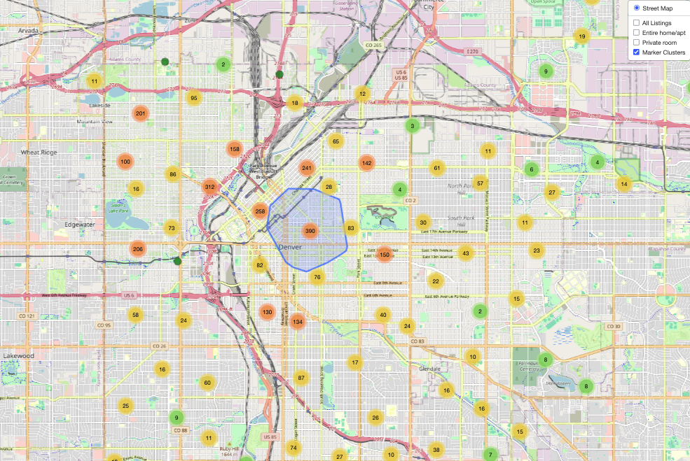
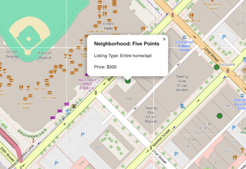
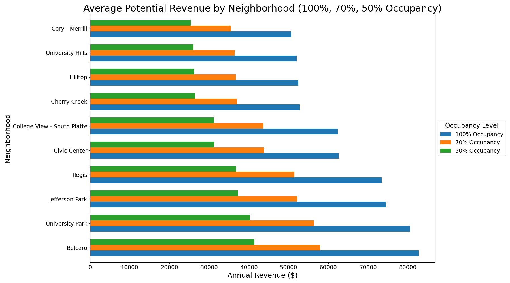
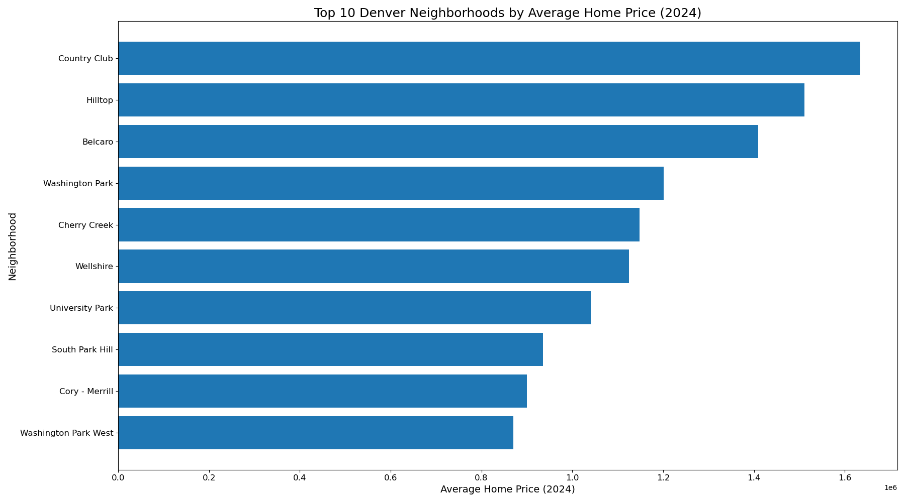
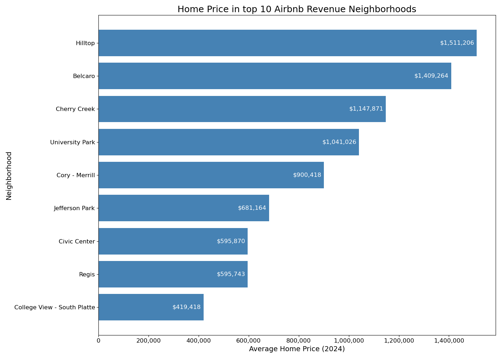
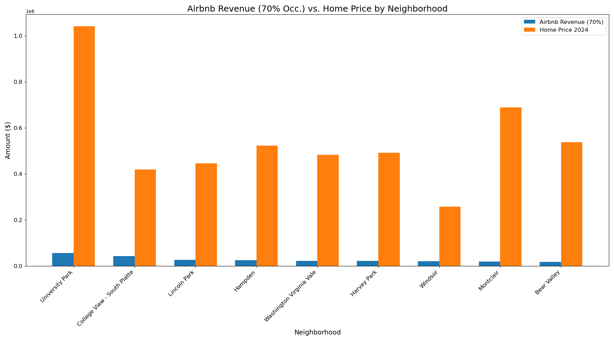
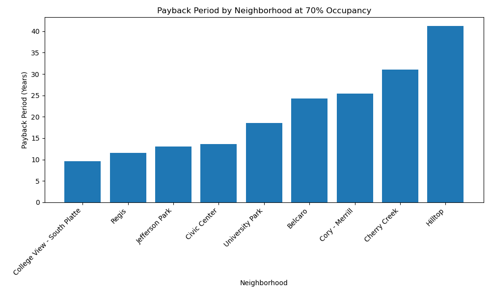
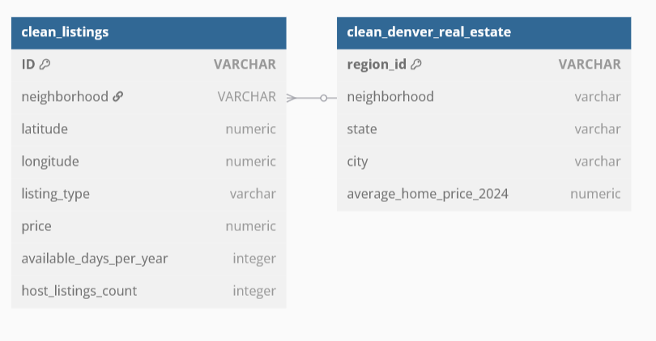

# Denver Airbnb Analysis
Creators: Luke Roberts, Kanchan Kumari, Angelina Murdock<br>
Date: April 2025

## Table of Contents
- [Project Description](#project-description)
- [Reasearch Questions to Answer](#research-questions-to-answer)
- [Features](#features)
- [Deployment](#deployment)
- [Key Findings](#key-findings)
- [Recommendation](#recommendation)
- [Methodology](#methodology)
- [Ethical Considerations](#ethical-considerations)
- [Opportunities for Further Analysis](#opportunities-for-further-analysis)
- [ERD](#erd)
- [Resources](#resources)

## Project Description
This project aims to analyze Airbnb listing data, specifically for Denver, Colorado, and gain insights on the listing demand, highest concentration areas, average annual income per property, and most profitable neighborhoods. This will be presented in multiple visualizations, such as an interactive map with markers for each listing and charts showing the income data. 

## Research Questions to Answer
1. What is the potential income of an Airbnb compared to the average home cost by neighborhood?
2. Which neighborhoods are the most profitable to host in?
3. Which neighborhoods have the most Airbnb listings?
4. How long will it take to make back your investment in each neighborhood?

## Features
- **Map Visualization:** Interactive map showing the concentration of Airbnb listings across Denver neighborhoods.
- **Data Visualizations:** Bar charts displaying potential revenue and average home prices by neighborhood to identify high-performing areas.
- **ERD**: Entity Relationship Diagram (ERD)
Visual overview of the data schema, illustrating how tables such as listings, neighborhoods, and pricing are related.

## Deployment
### GitHub Pages Link for the Map Visualization
- [Map Link](https://iniirie.github.io/Project-5_Group-3/Map/)

### Steps to Deploy Locally
**1. Clone the Repository:**
```bash
git clone https://github.com/iniirie/Project-5_Group-3.git 
```
**2. Open the Project:**
* Open the `airbnb.ipynb` Jupyter Notebook file to see the data cleaning and analysis.


## Map Visualization 
Interactive map created using Leaflet allows users to explore Airbnb listing data in Denver on a large and small scale.

#### Zoomed-out view showing overall listing density.


#### Example of a single marker with popup info.



## Key Findings
**Top Revenue Neighborhoods**: At a 70% occupancy rate, the potential gross earnings in these neighborhoods range between $35k - $60k per year. The neighborhoods with the highest revenue potential are Belcaro, University Park and Jefferson Park.



**Most Expensive Neighborhoods by Home Price:** While some of the most expensive neighborhoods are also in the top for Airbnb Revenue, for some of these neighborhoods the ROI is poor, as the entry cost is too high.



**Home Prices in Top Revenue Neighborhoods:** Home prices of top ten airbnb grossing neighborhoods range from just over $400k to just over $1.5m. Home price is not directly correlated to the potential Airbnb revenue.



**Best Value for Investment:**
Jefferson Park and Regis offer strong Airbnb revenue with lower home costs, making them great for ROI. Belcaro brings in the most revenue, but its high home prices make returns less efficient by comparison.



**Payback Period:** Ranges from ~9.5 years (College View – South Platte) to 40+ years (Hilltop).




## Recommendation
* We do not recommend targeting Belcaro, Hilltop or Cory - Merrill as the potential ROI is poor, or even losing money.
* Jefferson Park and Regis are the best neighborhoods to pursue for best cost to return ratio. 
* An investor would see the most rapid ROI in the College View - South Platte neighborhood, taking approximately 9.5 years to see the return. 
* The same investor would take over 40 years to see their investment fully recovered in the Hilltop neighborhood. 


## Methodology
### Data Processing and Visualization
**JavaScript Functions**: Used to render map layers, update visual elements based on user input, and integrate data with Leaflet for smooth map interactivity.

**Leaflet**: Used to create an interactive map that displays the distribution of Airbnb listings across Denver neighborhoods.

**Dask**: Utilized for efficient, scalable data processing to for handle large Airbnb and Zillow datasets during cleaning and transformation.

**MatplotLib**: Used to generate bar charts and other static visualizations that illustrate trends in potential revenue and average home prices by neighborhood.

## Ethical Considerations
All data used in this project was sourced from publicly available datasets, including Inside Airbnb and Zillow. These platforms publish data with the intent of supporting public awareness, research, and informed decision-making. We ensured proper citation and did not alter source data beyond necessary cleaning and formatting for analysis. While this project explores potential returns from Airbnb investments, the analysis is intended to inform responsible investment, not to promote unchecked short-term rental expansion.

## ERD


## Opportunities for Further Analysis
For further analysis on this project we would gather long-term rental data in these neighborhoods to see what the profit comparison is to short-term rentals. We would also break down all of the real estate pricing and potential revenue into specific home type categories. Additionaly, we would add an overlay to the map showing home sales in each neighborhood. Furthermore, finding out when the peak seasons are for Airbnb rentals and breaking the potential revenue down into monthly data would help an investor to see the full annual outlook. 

## Resources
- **DU Bootcamp Module 15:** Utilized challenge files and class materials from the bootcamp.
- **Airbnb data:** https://insideairbnb.com/get-the-data/ 
- **Zillow data:** https://www.zillow.com/research/data/ 
- **Using csv files in javascript:** https://medium.com/@ryan_forrester_/read-csv-files-in-javascript-how-to-guide-8d0ac6df082a 
- **Dask:** https://docs.dask.org/en/stable/ 
- **ChatGPT:** Assisted with converting a .csv file to a .js file. Also used to troubleshoot code.
- **ERD Creator**: https://dbdiagram.io/d 

